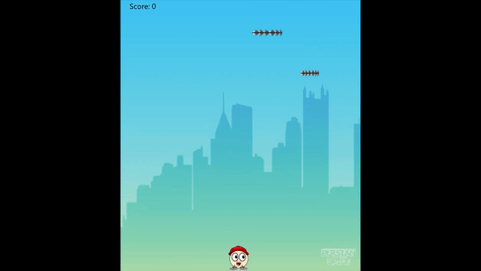
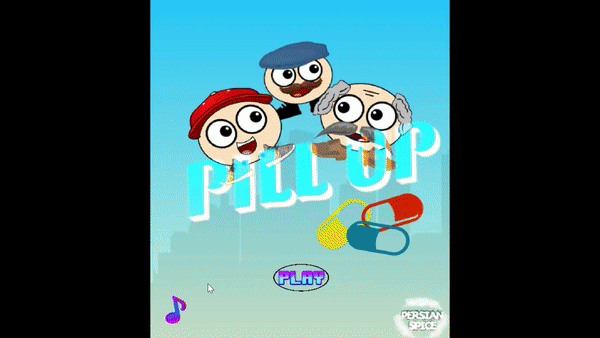

# Pill-Up
## BC Game Jam 2020 project
Collaborated along with other developers to make this 2-D collision detection game.

Implemented the game without the use of a game engine but with Java and JavaFX and 
delivered the final product in 48 hours including the design process.

Features  include the save and load of the score-board, settings for sound and background, beginner guide etc.

